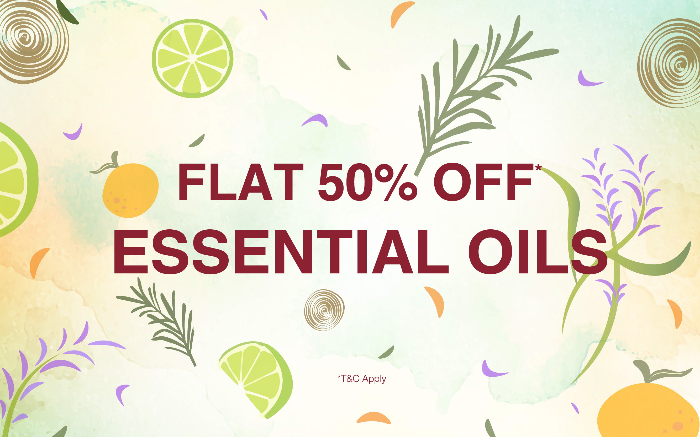
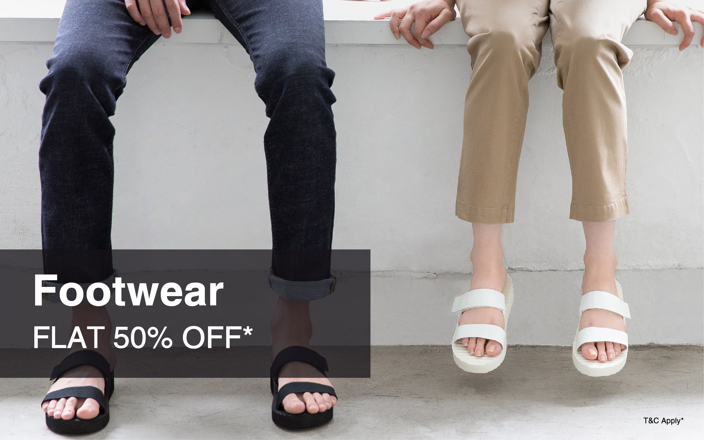
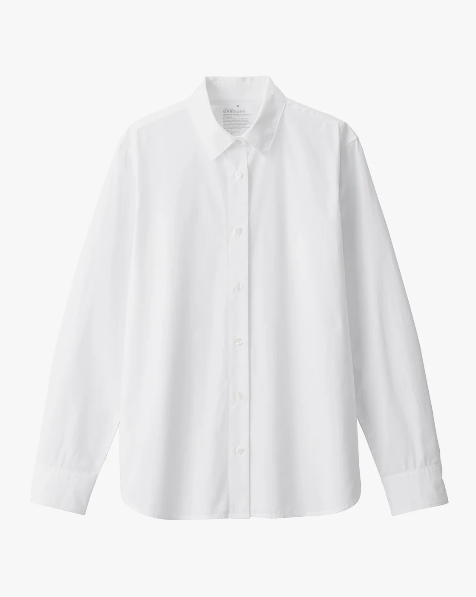
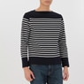
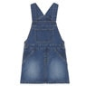
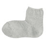

<!DOCTYPE html>
<html lang="en">
<head>
    <meta charset="UTF-8">
    <meta name="viewport" content="width=device-width, initial-scale=1.0">
    <link type="text/css" rel="stylesheet" href="muji.css">
    <link rel="preconnect" href="https://fonts.googleapis.com">
    <link rel="preconnect" href="https://fonts.gstatic.com" crossorigin>
    <link href="https://fonts.googleapis.com/css2?family=Roboto&display=swap" rel="stylesheet">
    <link rel="stylesheet" href="https://fonts.googleapis.com/css2?family=Material+Symbols+Outlined:opsz,wght,FILL,GRAD@20..48,100..700,0..1,-50..200" />
    <link rel="icon" href="muji-title-icon.jpeg" type="image/x-icon">
    <title>MUJI</title>

</head>
<body>
    

            

            
Product Information

            
Store Information

            
News

            
About MUJI

            
Contact Us

        

    

    
    

        
    

    

        
        
        
        
    

    

        
        
        
        
    

    
    

        
Products

        
Product Information

        <svg class="arrow" xmlns="http://www.w3.org/2000/svg" height="48" viewBox="0 -960 960 960" width="48">
            <path d="m304-82-56-57 343-343-343-343 56-57 400 400L304-82Z"/>
        </svg>
    

    

        

            
            
Women

        

        

            
            
Men

        

        

            
            
Kids

        

        

            
            
Accesories

        

        

            
            
Bags

        

        

            
            
Footwear

        

    

    
    
</body>
</html>
